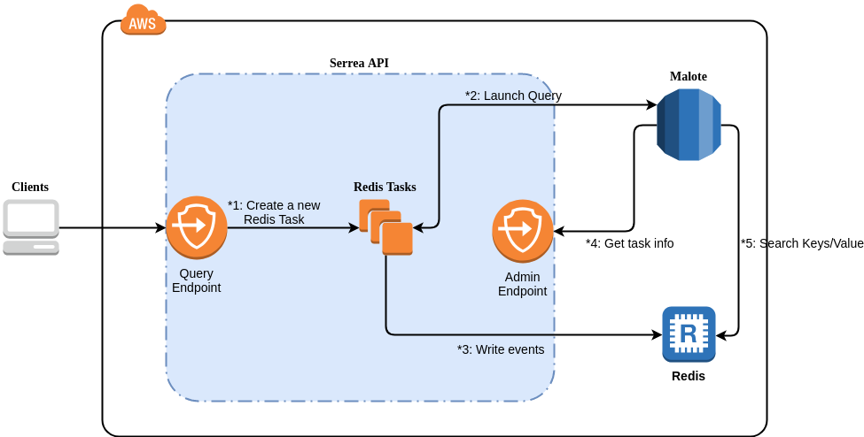

# Destination Redis

API have a Redis destination to enable Collections behaviour.

When API receive a query it will start query with "from date" = now - expiration and any "date from" or -1 to "forever". This query will get all events, hash the selected columns (eventdate is mandatory) and write in redis with a expiration = eventdate + expiration.



1. A client/web launch a new query with a redis destination. It uses public "/query" endpoint. It create a new redis task.  
2. This redis task will query DB and get all events.
3. For each event the task will hash select columns and send it to redis. Using a common prefix + hash of data event for key.
4. Malote will ask to API about its task info, when somebody make a query using virtual table "system.internal.serrea.task.redis" or "system.internal.serrea.task". It's using on web collections management. Malote uses a private "/admin" endpoint to query API.
5. Malote will look for keys on Redis when for each cchas or ccget operations.

## How to use

This destination have 2 modes:

- Create a hash for the event date and sent to redis.
- Create a hash and serialize data of the event date and sent to redis.

- **Parameters:**

| Key | Type | Required | Description |
| --- | --- | --- | --- |
| friendlyName | string | Yes | It's the redis task name and it must be unique.  |
| description | string | No | A simple description about the task (max. 240 characters)  |
| expireIn | long | Yes | Number of seconds of ttl of all event data, after that time this row will be removed. |
| keyFields | list<string> | Yes | List of fields to add in hash, and this hash will be stored in redis. It must be a columns names of query results. Take care because all fields must be exist in query results. It cannot be empty o null |
| valueFields | list<string> | No | List of fields to stored in redis. It must be a columns names of query results. Take care because all fields must be exist in query results. |

### Example


```pyton
api = Client(auth={"key": "myapikey",
                   "secret": "myapisecret"},
             address="https://apiv2-eu.devo.com/search/query",
             config=ClientConfig(response="json", stream=False, processor=JSON,
                                 destination= { 
                                     "type":"redis",
                                     "params":{
                                          "friendlyName":"redis-rresino-154q", 
                                            "description": "description of task",
                                            "expireIn": 30000,
                                            "keyFields": [{
                                                "name": "domain",
                                                "type": "str"
                                            }, {
                                                "name": "username",
                                                "type": "str"
                                            }],
                                            "valueFields": [{
                                                "name": "domain",
                                                "type": "str"
                                            }, {
                                                "name": "username",
                                                "type": "str"
                                            }]
                                        },
                                     }))


response = api.query("from siem.logtrust.web.activity select * limit 10",
                     dates={"from": "yesterday()", "to": "now()"})

```

## Results

For each result will be store hash or field serialize:

- Only Hash: It will store the hash of value and the last event date.
- Hash + Content:  

All the redis data will be set a expiration date (set by request parameter) and it will be remove by redis.  

As response to the request if it is successful it will return a Task Id, that should be used to get the information about the progress of the task.

```json
{
    "msg": "",
    "status": 0,
    "object": {
        "id": "13d359-93df-406f-bdf7-acf1a8u7h552",
        "redisKeyBase": "self#affa0000011111222223333"
    }
}
```

where:

- *id: (string) internal identifier of the task, will be used in other task operations
- *redisKeyBase: prefix of all the keys generated by this task and storage in Redis. redisKeyBase = domainName + "#" + hex(MD5(domainNanme+FriendlyName))

### Checking the Status

Using the previous returned id, call Check Status Request, you will get the status of the task

fields in object;

| Field Name | Type  | Description |
|------------|-------|-------------|
| status     | String| (NOTE: object.status values are described in Background/Async Tasks  Section at the bottom of this document)|
|lastDatetime| long  |value of milliseconds of last date of an event received by malote|
| type       | String|"redis", the type of the task|
| friendlyName | String | Name given by the user to this task |
| query      | String | LinQ or QueryId of the Query associated to this task|
| error      | list   | List of errors on any, when running the task |
| extra      | object | custom object that returns data that the Task want to share |

### Extra Object

| Field Name | Type  | Description |
|------------|-------|-------------|
| redisKeyBase |String  |prefix of all the keys generated by this task and storage in Redis. redisKeyBase = domainName + "#" + hex(MD5(domainNanme+FriendlyName))  |
| keyFields | list | list of the fields of the query used to compound the key storaged in Redis.(each field object is compound by name and type (see loxcope types) |
| description | String | if any, the description set by the user |
| expireIn | int | number of seconds the keys stored in Redis persist |

```json
{
    "status": 0,
    "object": {
        "status": "RUNNING",
        "id": "8e10f496-27bc-4c47-9113-653aff8d0edd",
        "lastDatetime": 1515398134810,
        "extra": {
            "redisKeyBase": "self#affa6b69ce8e06a43b6cc4e206798326",
            "keyFields": [
                {
                    "name": "domain",
                    "type": "str"
                },
                {
                    "name": "username",
                    "type": "str"
                }
            ],
            "description": "descripcion de la tarea que vamos a iniciar de redis",
            "expireIn": 300
        },
        "type": "redis",
        "friendlyName": "redis-001",
        "query": "from siem.logtrust.web.activityAll group every 5m by domain, username every 5m",
        "error": []
    }
}
```
